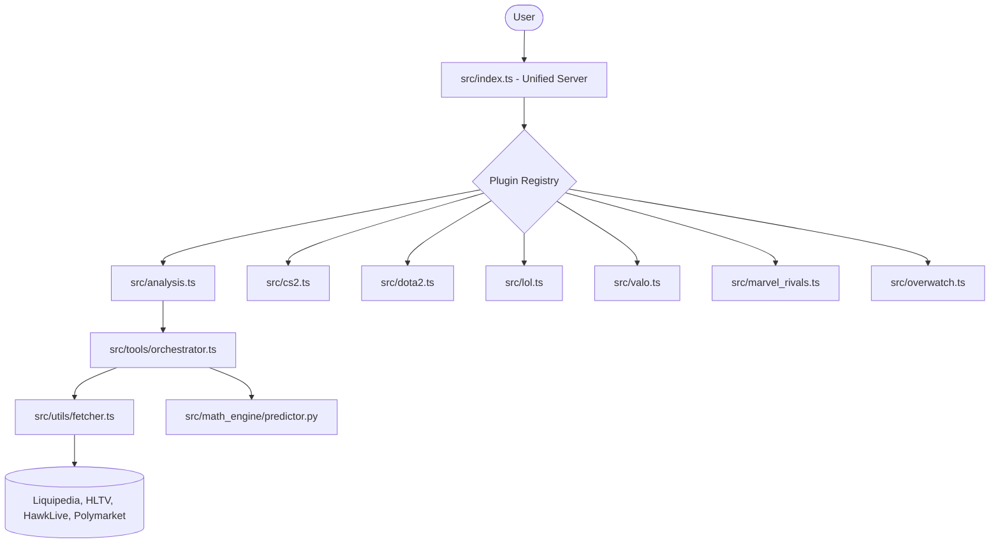

# Esports Data MCP

Standardized data interfaces for competitive esports analytics are provided by this MCP server, enabling seamless integration with betting platforms, statistical models, and live dashboards.

## Architecture & Technology

A modern **Medallion Data Architecture** combined with a robust **Bayesian Math Engine** is utilized to provide high-fidelity predictions.

### 1. Data Engineering (Medallion Pipeline)
- **Bronze Layer (Raw):** Chaotic data is ingested from multiple sources (Liquipedia, HLTV, HawkLive, Polymarket).
- **Silver Layer (Normalized):** Data is cleaned, validated, and normalized using the `GameDataSchema`. Consistency for player roles (e.g., "Carry" vs. "Pos 1") and game-specific variables is ensured across all titles.
- **Gold Layer (Analysis):** Structured feature vectors are prepared for the predictive models.
- **Human-Mimicry Stealth:** `puppeteer-extra-plugin-stealth` is used with randomized headers, User-Agents, and interaction patterns to prevent bans and ensure reliable access to live data.

### 2. Bayesian Math Engine (Python/PyMC)
Predictions are powered by a dedicated Python service (`src/math_engine/`) utilizing **Hierarchical Bayesian Modeling**.

#### Bayesian Inference
Win probabilities are estimated using the Beta-Bernoulli conjugate prior.
$$P(\theta | y) = \frac{P(y | \theta) P(\theta)}{P(y)}$$

Given a prior distribution $\theta \sim \text{Beta}(\alpha, \beta)$ and $n$ observed matches with $k$ wins, the posterior distribution is updated as:
$$\theta | y \sim \text{Beta}(\alpha + k, \beta + n - k)$$

#### Kelly Criterion
The optimal wager size is calculated to maximize logarithmic growth of the bankroll:
$$f^* = \frac{bp - q}{b}$$
Where:
- $f^*$ is the fraction of the bankroll to wager.
- $b$ is the net odds received ($decimal\_odds - 1$).
- $p$ is the probability of winning.
- $q$ is the probability of losing ($1 - p$).

### System Architecture


### Decision Log: Architectural Evolution
- **Refactor from Monkey-Patching (2026-05-28):** Migration from a monolithic `index.ts` to a modular Plugin Registry pattern was completed. Type safety is ensured, runtime crashes from conflicting server instances are prevented, and alignment with senior engineering standards for MCP server development is maintained.
- **Strict Validation with Zod (2026-05-28):** Loose argument handling was replaced with strict Zod schemas for every tool. Immediate feedback on malformed inputs is provided and downstream mathematical errors in the Bayesian engine are prevented.

## Available Tools

| Category | Tool | Description |
|---|---|---|
| Orchestration | `analyze_match` | Single endpoint for full analysis pipeline (fetch, normalize, sentiment, math, recommendation) is provided. |
| Statistical Analysis | `analyze_match_bayesian` | Unified Bayesian Engine is utilized. Manual team stats and historical data are required. |
| Statistical Analysis | `get_fair_odds` | Elo and Draft-based probability calculation is performed. |
| Statistical Analysis | `calculate_kelly_wager` | Optimal bet sizing based on bankroll and edge is determined. |
| Data Fetcher (Dota 2) | `get_dota2_heroes` | Dota 2 hero data is fetched. |
| Data Fetcher (Dota 2) | `get_dota2_live_matches` | Live Dota 2 matches are fetched. |
| Data Fetcher (Dota 2) | `search_dota2_teams` | Dota 2 teams are searched. |
| Data Fetcher (Dota 2) | `get_dota2_team_info` | Dota 2 team information is retrieved. |
| Data Fetcher (Dota 2) | `get_dota2_team_roster` | Dota 2 team roster is retrieved. |
| Data Fetcher (Dota 2) | `get_dota2_team_match_history` | Dota 2 team match history is retrieved. |
| Data Fetcher (CS2) | `get_cs2_matches` | CS2 matches are fetched. |
| Data Fetcher (CS2) | `get_cs2_team_info` | CS2 team information is retrieved. |
| Data Fetcher (CS2) | `get_cs2_player_stats` | CS2 player statistics are retrieved. |
| Data Fetcher (Valorant) | `get_valo_matches` | Valorant matches are fetched. |
| Data Fetcher (Valorant) | `get_valo_events` | Valorant events are fetched. |
| Data Fetcher (Valorant) | `get_valo_team_info` | Valorant team information is retrieved. |
| Data Fetcher (League of Legends) | `get_lol_matches` | League of Legends matches are fetched. |
| Data Fetcher (League of Legends) | `get_lol_team_info` | League of Legends team information is retrieved. |
| Data Fetcher (League of Legends) | `get_lol_gol_team_stats` | League of Legends team stats from GOL are retrieved. |

## Getting Started

### Prerequisites
- **Node.js**: v18+ is required.
- **Python**: v3.9+ (with `pymc`, `pandas`, `numpy`) is required.
  ```bash
  pip install -r src/math_engine/requirements.txt
  ```

### MCP Configuration
The following snippet is added to the `mcp.json` or `config.json` file:
```json
{
  "mcpServers": {
    "esports-analysis": {
      "command": "node",
      "args": ["C:/Users/user/esports_betting_mcp/dist/analysis.js"],
      "cwd": "C:/Users/user/esports_betting_mcp"
    }
  }
}
```

### Installation
1. The repository is cloned:
   ```bash
   git clone https://github.com/thekogit/esports-data-mcp.git
   cd esports-data-mcp
   ```
2. Dependencies are installed:
   ```bash
   npm install
   ```
3. The project is built:
   ```bash
   npm run build
   ```

