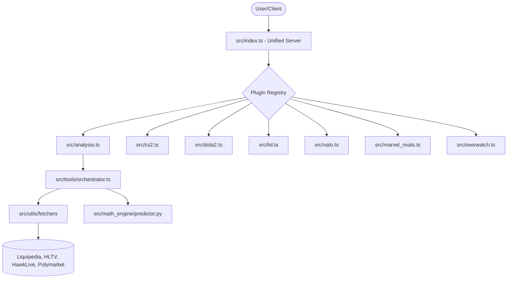

# Esports Data MCP

This MCP server provides standardized data interfaces for competitive esports analytics, enabling seamless integration with betting platforms, statistical models, and live dashboards.

## Architecture & Technology

We use a modern **Medallion Data Architecture** combined with a robust **Bayesian Math Engine** to provide high-fidelity predictions.

### 1. Data Engineering (Medallion Pipeline)
- **Bronze Layer (Raw):** Chaotic data from multiple sources (Liquipedia, HLTV, HawkLive, Polymarket).
- **Silver Layer (Normalized):** Data is cleaned, validated, and normalized using our `GameDataSchema`. This ensures player roles (e.g., "Carry" vs. "Pos 1") and game-specific variables are consistent across all titles.
- **Gold Layer (Analysis):** Structured feature vectors ready for the predictive models.
- **Human-Mimicry Stealth:** Our fetchers use `puppeteer-extra-plugin-stealth` with randomized headers, User-Agents, and interaction patterns to prevent bans and ensure reliable access to live data.

### 2. Bayesian Math Engine (Python/PyMC)
Predictions are powered by a dedicated Python service (`src/math_engine/`) using **Hierarchical Bayesian Modeling**.
- **Priors:** Historical performance at the Player, Hero, and Map levels.
- **Likelihood:** Real-time data from live match drafts and **Polymarket** sentiment (captured as a crowd-sourced prior).
- **Inference:** We calculate posterior win probabilities with confidence intervals, accounting for the uncertainty inherent in low-sample e-sports data.

### System Architecture


### Decision Log: Architectural Evolution
- **Refactor from Monkey-Patching (2026-05-28):** Migrated from a monolithic `index.ts` that used `Module.prototype.require` hacks to a modular Plugin Registry pattern. This ensures type safety, prevents runtime crashes from conflicting server instances, and aligns with senior engineering standards for MCP server development.
- **Strict Validation with Zod (2026-05-28):** Replaced loose argument handling with strict Zod schemas for every tool. This provides immediate feedback on malformed inputs and prevents downstream mathematical errors in the Bayesian engine.

## Available Tools

### 🚀 Smart Orchestrator (Recommended)
- `analyze_match`: **The "One-Tool" Solution.** Simply provide a match URL (e.g., HawkLive or Liquipedia) and the game type. The orchestrator automatically:
  1. Fetches and normalizes raw data.
  2. Gathers market sentiment from Polymarket.
  3. Executes the Bayesian Math Engine.
  4. Returns a comprehensive "Best Bet" recommendation with Kelly Criterion bankroll management.

### Statistical Analysis (Advanced)
- `analyze_match_bayesian`: Unified Bayesian Engine (Legacy/Detailed). Manually provide team stats and historical data for granular control.
- `get_fair_odds`: Elo and Draft-based probability calculation.
- `calculate_kelly_wager`: Optimal bet sizing based on bankroll and edge.

### Title-Specific Data Fetchers
- **Dota 2:** `get_dota2_heroes`, `get_dota2_live_matches`, `search_dota2_teams`, `get_dota2_team_info`, `get_dota2_team_roster`, `get_dota2_team_match_history`.
- **CS2:** `get_cs2_matches`, `get_cs2_team_info`, `get_cs2_player_stats`.
- **Valorant:** `get_valo_matches`, `get_valo_events`, `get_valo_team_info`.
- **League of Legends:** `get_lol_matches`, `get_lol_team_info`, `get_lol_gol_team_stats`.

## Getting Started

### Prerequisites
- **Node.js**: v18+
- **Python**: v3.9+ (with `pymc`, `pandas`, `numpy`)
  ```bash
  pip install -r src/math_engine/requirements.txt
  ```

### MCP Configuration
Add the following snippet to your `mcp.json` or `config.json`:
```json
{
  "mcpServers": {
    "esports-analysis": {
      "command": "node",
      "args": ["C:/Users/user/esports_betting_mcp/dist/analysis.js"],
      "cwd": "C:/Users/user/esports_betting_mcp"
    }
  }
}
```

### Installation
1. Clone the repository:
   ```bash
   git clone https://github.com/thekogit/esports-data-mcp.git
   cd esports-data-mcp
   ```
2. Install dependencies:
   ```bash
   npm install
   ```
3. Build the project:
   ```bash
   npm run build
   ```

